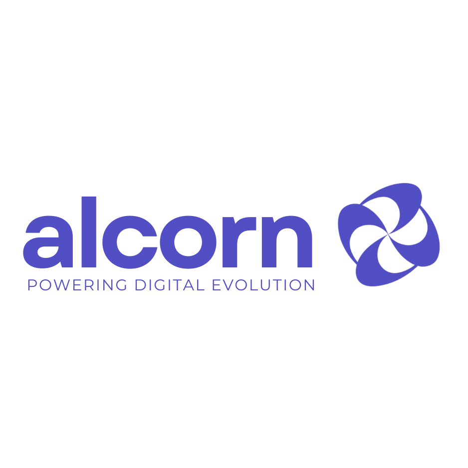
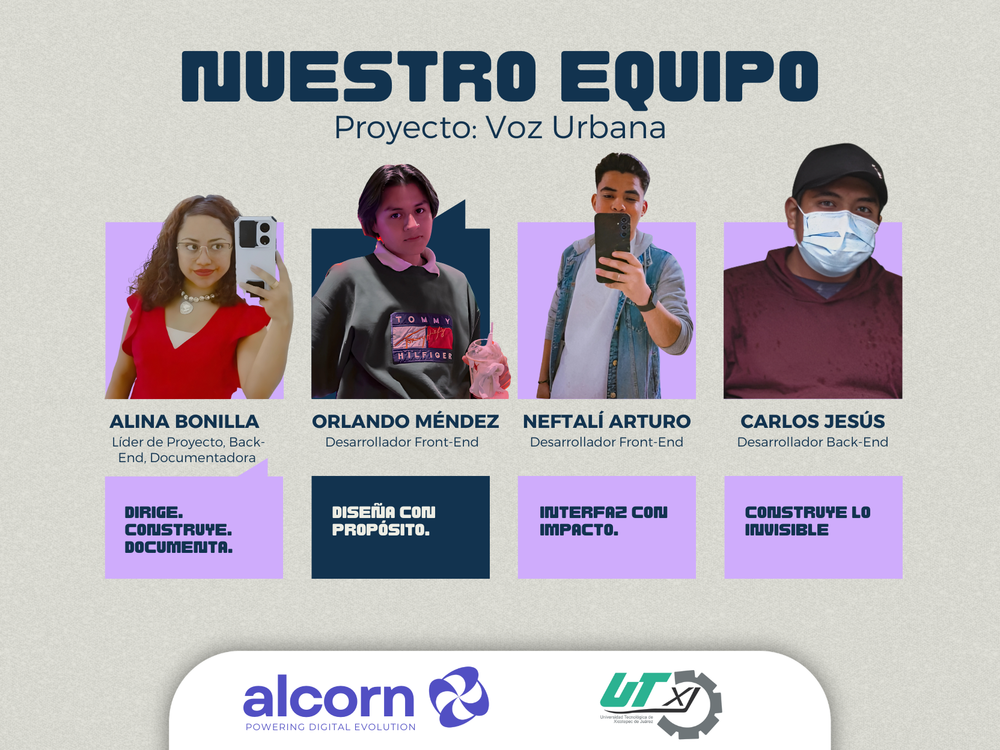

# TI-9B-ALCORN-Voz-Urbana

## Repositorios del Proyecto

- **Frontend**: [Interfaces gráficas para usuarios y administradores](https://github.com/Nefta11/VozUrbanaFrontend)  
  Contiene el desarrollo de las interfaces web tanto para los ciudadanos como para el panel administrativo.

- **Backend**: [API RESTful](https://github.com/CarlosJ67/Backend-Voz-Urbana)  
  Implementa la lógica del servidor, la base de datos y los servicios necesarios para la operación del sistema.

- **Aplicación para Wearable**: [App para smartwatch con Wear OS](https://github.com/MendezPro/VozUrbana-WearOS-Android)  
  Permite a los usuarios interactuar con el sistema desde dispositivos inteligentes portátiles.

<table>
  <tr>
    <td style="text-align: center;">
       
      <strong>Logo Voz Urbana</strong>
    </td>
    <td style="text-align: center;">
       
      <strong>Logo de ALRCORN</strong>
    </td>
  </tr>
</table>

  
  
<strong>Organigrama del Equipo</strong>

<h3>Colaboradores</h3>

<table style="width: 100%; border-collapse: collapse; margin-top: 30px;">
  <thead>
    <tr>
      <th style="border: 1px solid #ddd; padding: 8px; text-align: center;">Colaborador</th>
      <th style="border: 1px solid #ddd; padding: 8px; text-align: center;">Perfil</th>
      <th style="border: 1px solid #ddd; padding: 8px; text-align: center;">Contribuciones</th>
    </tr>
  </thead>
  <tbody>
  <tr>
      <td style="border: 1px solid #ddd; padding: 8px; text-align: center;">Alina Bonilla Paredes</td>
      <td style="border: 1px solid #ddd; padding: 8px; text-align: center;"><a href="https://github.com/Ali-2121" target="_blank">@Alina</a></td>
      <td style="border: 1px solid #ddd; padding: 8px; text-align: center;">Lider del Proyecto</td>
    </tr>
    <tr>
      <td style="border: 1px solid #ddd; padding: 8px; text-align: center;">Neftalí A. Hernández Vergara</td>
      <td style="border: 1px solid #ddd; padding: 8px; text-align: center;"><a href="https://github.com/Nefta11" target="_blank">@Nefta</a></td>
      <td style="border: 1px solid #ddd; padding: 8px; text-align: center;">Desarrollador Frontend</td>
    </tr>
    <tr>
      <td style="border: 1px solid #ddd; padding: 8px; text-align: center;">Carlos Jesus Carballo Cruz</td>
      <td style="border: 1px solid #ddd; padding: 8px; text-align: center;"><a href="https://github.com/CarlosJ67" target="_blank">@Carballo</a></td>
      <td style="border: 1px solid #ddd; padding: 8px; text-align: center;">Desarrollador Backend</td>
    </tr>
    <tr>
      <td style="border: 1px solid #ddd; padding: 8px; text-align: center;">Oralndo Mendez Montes</td>
      <td style="border: 1px solid #ddd; padding: 8px; text-align: center;"><a href="https://github.com/MendezPro" target="_blank">@Orlando</a></td>
      <td style="border: 1px solid #ddd; padding: 8px; text-align: center;">Desarrollador Mobile</td>
    </tr>
  </tbody>
</table>

## Planteamiento del problema

**Xicotepec de Juárez, Puebla**, es una ciudad con gran variedad social y cultural, donde conviven zonas urbanas y rurales que enfrentan distintos desafíos en materia de **servicios públicos, vialidad, seguridad, salud y medio ambiente**.

A pesar de que existen canales institucionales para reportar estos problemas, muchas veces los ciudadanos **no cuentan con mecanismos ágiles, transparentes y accesibles** para avisar de forma rápida sobre los problemas en su entorno. Esto genera una **brecha entre la comunidad y las autoridades locales**, dificultando la participación ciudadana efectiva y el seguimiento adecuado de las problemáticas reportadas.

En este contexto, se ha identificado la necesidad de desarrollar una **plataforma digital**, diseñada para los habitantes de Xicotepec de Juárez, que funcione como un **espacio abierto y seguro** donde los usuarios puedan publicar reportes relacionados con situaciones que afectan su comunidad.

Estos reportes estarán **clasificados por categorías** y permitirán la **interacción de otros usuarios mediante comentarios y reacciones**, generando así un espacio de diálogo digital. Para garantizar un entorno seguro, **el administrador revisará cada reporte antes de su publicación** para evitar contenido inapropiado, como lenguaje ofensivo, imágenes explícitas o información no apta para el público en general.

---

## Objetivos específicos

1. **Desarrollar una plataforma web funcional y segura** para los habitantes de Xicotepec, donde los ciudadanos registrados puedan generar reportes clasificados por categorías, así como comentar y reaccionar ante otros reportes.
2. **Implementar un sistema de autenticación de usuarios** que asegure la integridad y trazabilidad de las publicaciones.
3. **Diseñar una interfaz de administración** que permita al responsable del sistema aprobar o rechazar reportes antes de su difusión pública, así como visualizar gráficamente la cantidad de reportes publicados.

---

## Justificación del uso de análisis de datos

El uso de **técnicas de análisis de datos** en *Voz Urbana* permitirá transformar la participación digital en **conocimiento útil para la comunidad y las autoridades de Xicotepec**.

A través del análisis de reportes, comentarios y reacciones, será posible **identificar tendencias locales y zonas de mayor conflicto**. Esta información, al ser representada en la interfaz del administrador, fortalecerá la **transparencia** y permitirá a los **tomadores de decisiones priorizar acciones**, proponer políticas públicas basadas en evidencia y fomentar una **cultura de colaboración entre ciudadanía y gobierno**.

## Lista de tecnologías

### Frontend
 
  
    

### Backend
  
  
  

 

### Base de Datos
  
  

### Documentación
  

