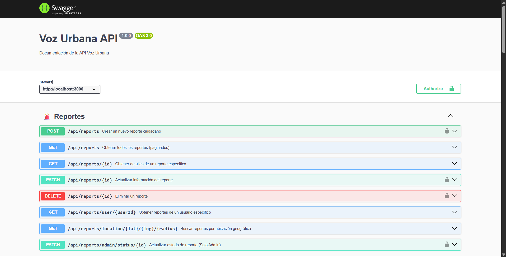
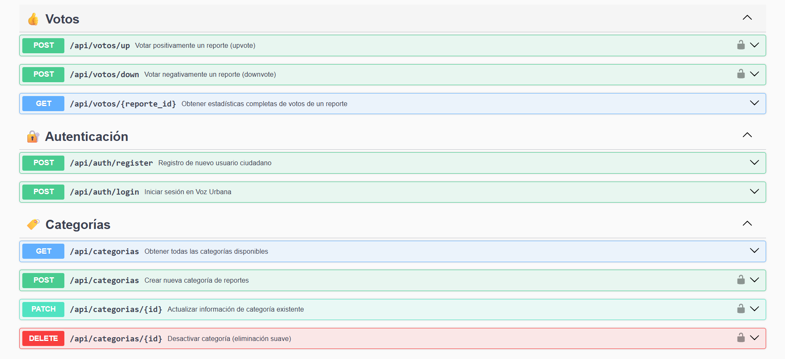
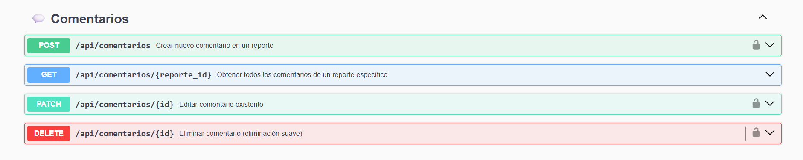
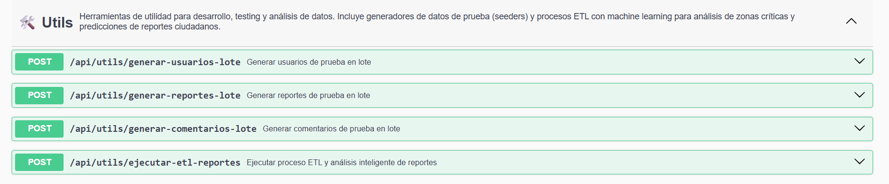

# API

## Código Fuente
**Repositorio API:** https://github.com/CarlosJ67/Backend-Voz-Urbana

## Operaciones CRUD Básicas
La API implementa operaciones básicas para la gestión de entidades del sistema de reportes ciudadanos:

- **GET**: Obtener información de entidades (listados, detalles, filtros)
- **POST**: Crear nuevos registros (usuarios, reportes, comentarios, votos)
- **PUT**: Actualizar registros completos de entidades
- **PATCH**: Actualizar parcialmente registros (estados, prioridades)
- **DELETE**: Eliminar registros existentes del sistema

## Listado de EndPoints de las Entidades

| Entidad | Endpoint | Método | Descripción |
|---------|----------|--------|-------------|
| **Autenticación** | `/api/auth/register` | POST | Registro de nuevo usuario en el sistema |
| **Autenticación** | `/api/auth/login` | POST | Inicio de sesión y obtención de token JWT |
| **Categorías** | `/api/categorias` | GET | Obtener todas las categorías activas |
| **Categorías** | `/api/categorias` | POST | Crear nueva categoría (solo admin) |
| **Categorías** | `/api/categorias/:id` | PATCH | Actualizar categoría existente (solo admin) |
| **Categorías** | `/api/categorias/:id` | DELETE | Eliminar categoría (solo admin) |
| **Reportes** | `/api/reports` | GET | Listar todos los reportes con filtros |
| **Reportes** | `/api/reports` | POST | Crear nuevo reporte ciudadano |
| **Reportes** | `/api/reports/:id` | GET | Obtener detalle específico de un reporte |
| **Reportes** | `/api/reports/:id` | PATCH | Actualizar reporte existente |
| **Reportes** | `/api/reports/:id` | DELETE | Eliminar reporte del sistema |
| **Reportes** | `/api/reports/user/:userId` | GET | Obtener reportes de un usuario específico |
| **Reportes** | `/api/reports/location/:lat/:lng/:radius` | GET | Buscar reportes por ubicación geográfica |
| **Reportes** | `/api/reports/admin/status/:id` | PATCH | Cambiar estado de reporte (solo admin) |
| **Comentarios** | `/api/comentarios/:reporte_id` | GET | Obtener comentarios de un reporte |
| **Comentarios** | `/api/comentarios` | POST | Crear comentario en un reporte |
| **Comentarios** | `/api/comentarios/:id` | PATCH | Editar comentario propio |
| **Comentarios** | `/api/comentarios/:id` | DELETE | Eliminar comentario propio |
| **Votos** | `/api/votos/up` | POST | Votar positivamente un reporte |
| **Votos** | `/api/votos/down` | POST | Votar negativamente un reporte |
| **Votos** | `/api/votos/:reporte_id` | GET | Obtener estadísticas de votos de un reporte |
| **Test/WebSocket** | `/api/test/new-report` | POST | Probar notificación de nuevo reporte |
| **Test/WebSocket** | `/api/test/status-change` | POST | Probar notificación de cambio de estado |
| **Test/WebSocket** | `/api/test/pending-reports` | POST | Probar notificación de reportes pendientes |
| **Test/WebSocket** | `/api/test/health` | GET | Verificar estado de conectividad |

## Screenshots (Capturas de Pantalla)
De los endpoint que generan las operaciones CRUD.

### Endpoints - Operaciones CRUD Básicas

# Endpoints que utilizan ML (Machine Learning)
La API incluye endpoints especializados que utilizan algoritmos de Machine Learning para análisis de datos, detección de patrones y toma de decisiones automatizadas sobre los reportes ciudadanos. Estos endpoints ejecutan procesos ETL, análisis supervisado y no supervisado para identificar zonas críticas y generar predicciones.

- **GET**: Consultar resultados de análisis ML y datos procesados
- **POST**: Ejecutar procesos ETL, clustering y análisis predictivo
- **PATCH**: Actualizar parámetros de modelos ML
- **DELETE**: Limpiar datos de análisis temporales

## Listado de EndPoints que consumen ML

| Endpoint | Método | Descripción |
|----------|--------|-------------|
| `/api/utils/ejecutar-etl-reportes` | POST | Ejecuta proceso ETL completo con análisis híbrido (clustering + predicción) |
| `/api/utils/generar-usuarios-lote` | POST | Genera datasets masivos de usuarios para entrenamiento de modelos |
| `/api/utils/generar-reportes-lote` | POST | Genera datasets masivos de reportes con patrones geográficos para ML |
| `/api/utils/generar-comentarios-lote` | POST | Genera datasets de comentarios para análisis de sentimientos |

### Detalles de Algoritmos ML Implementados:

**ETL con Machine Learning Híbrido:**
- **Análisis No Supervisado:** Clustering DBSCAN para detección de zonas críticas
- **Análisis Supervisado:** Random Forest para predicción de reportes futuros
- **Métricas de Calidad:** Silhouette Score, Calinski-Harabasz Index
- **Visualizaciones:** Mapas de calor, gráficos de dispersión, análisis temporal
- **Exportación:** Archivos CSV procesados, modelos .pkl, gráficos PNG

**Funcionalidades Avanzadas:**
- Detección automática de zonas críticas por densidad geográfica
- Predicción de incremento de reportes por zona y categoría
- Análisis temporal de patrones de reportes
- Recomendaciones automáticas para autoridades municipales
- Scoring de prioridad basado en algoritmos ML

## Screenshots (Capturas de Pantalla)
De los endpoint que generan las operaciones de análisis supervisado y análisis no supervisado.

### Endpoints ML - Operaciones de Análisis Avanzado

