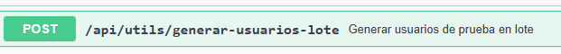
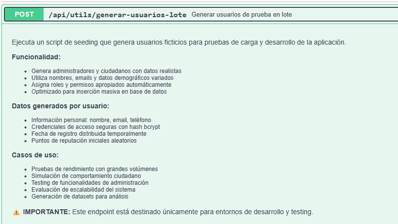
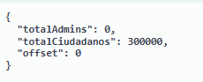
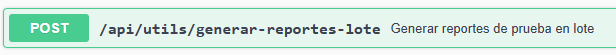
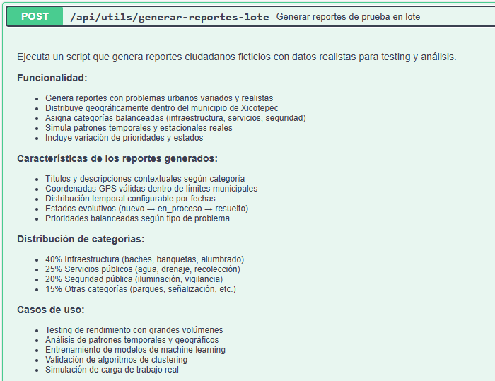
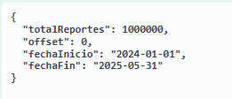
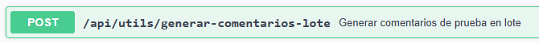
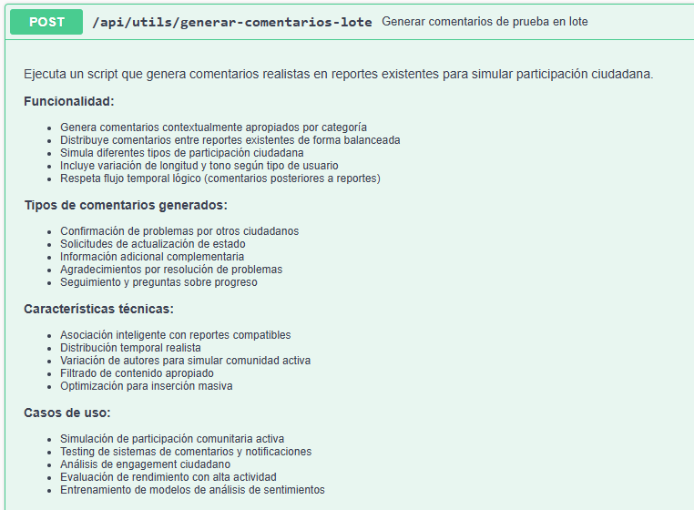
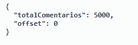

# Seeder

## Código fuente
En la siguiente carpeta se encuentra el código fuente utilizado para generar los datos simulados:  
🔗 [Repositorio de Seeders – Backend Voz Urbana](https://github.com/CarlosJ67/Backend-Voz-Urbana/tree/main/seeders)

---

## Respaldo de la BD vacía (sin datos)  
En esta misma carpeta se encuentra el archivo que contiene la **estructura** de la Base de Datos (relacional), sin datos cargados.

Nombre: **Respaldo_Voz_Urbana_Vacio.sql**

---

## Listado de Endpoints para generar datos simulados  
<table>
  <thead>
    <tr>
      <th>Endpoint</th>
      <th>Parámetros (JSON)</th>
      <th>Funcionalidad</th>
    </tr>
  </thead>
  <tbody>
    <tr>
      <td><code>/generar-usuarios-lote</code></td>
      <td>
        <pre><code class="language-json">{
  "totalAdmins": 2,
  "totalCiudadanos": 300,
  "offset": 0
}</code></pre>
      </td>
      <td>
        - Genera administradores y ciudadanos con datos realistas. 
        - Utiliza nombres y  correos variados. 
        - Asigna roles y permisos automáticamente. 
        - Optimizado para inserción masiva en la base de datos.
      </td>
    </tr>
    <tr>
      <td><code>/generar-reportes-lote</code></td>
      <td>
        <pre><code class="language-json">{
  "totalReportes": 1000000,
  "offset": 0,
  "fechaInicio": "2024-01-01",
  "fechaFin": "2025-05-31"
}</code></pre>
      </td>
      <td>
        - Genera reportes de problemas urbanos variados y realistas. 
        - Distribuye datos geográficamente dentro del municipio de Xicotepec. 
        - Asigna categorías balanceadas (infraestructura, servicios, seguridad). 
        - Incluye variación de prioridades y estados.
      </td>
    </tr>
    <tr>
      <td><code>/generar-comentarios-lote</code></td>
      <td>
        <pre><code class="language-json">{
  "totalComentarios": 5000,
  "offset": 0
}</code></pre>
      </td>
      <td>
        - Genera comentarios contextualmente apropiados por categoría. 
        - Distribuye comentarios entre reportes existentes de forma balanceada. 
        - Simula diferentes tipos de participación ciudadana. 
        - Respeta el flujo temporal lógico (comentarios posteriores a los reportes).
      </td>
    </tr>
  </tbody>
</table>

---

## Screenshots (Capturas de pantalla)  

<table>
  <thead>
    <tr>
      <th>Descripción</th>
      <th>Imagen</th>
    </tr>
  </thead>
  <tbody>
    <tr>
      <td>Endpoint para generar usuarios</td>
      <td>   </td>
    </tr>
    <tr>
      <td>Endpoint para generar reportes</td>
      <td>   </td>
    </tr>
    <tr>
      <td>Endpoint para generar comentarios</td>
      <td>   </td>
    </tr>
  </tbody>
</table>

---

## Respaldo de la BD post llenado (1,000,000 de registros)  
En esta misma carpeta se encuentra el archivo que contiene la **Base de Datos ya poblada** con 1 millón de registros, los cuales servirán para alimentar los algoritmos de **análisis supervisado y no supervisado**.

Nombre: **Respaldo_Voz_Urbana_Con_Datos.sql**
